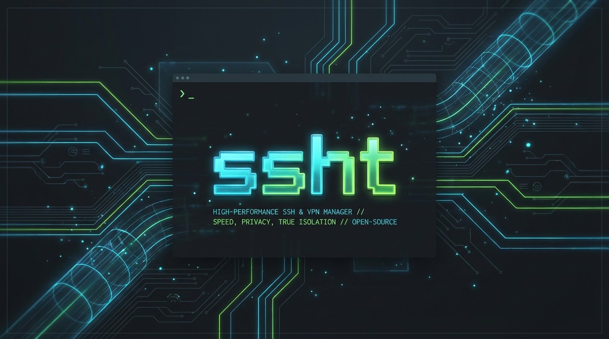

# ssht

[](https://goreportcard.com/report/github.com/akunbeben/ssht)
[](https://opensource.org/licenses/MIT)



ssht is a high-performance SSH & VPN manager designed for speed, privacy, and true network isolation. It replaces the tedious mess of ~/.ssh/config and manual VPN toggling with a sleek Terminal UI (TUI).

## Key Features

### Isolated VPN (Multi-Protocol Support)
Unlike standard VPN tools that change your global network settings, ssht establishes a User-Space tunnel exclusively for your SSH session.
- **Multiple Protocols**: Support for WireGuard, ShadowSocks, Trojan, and OpenVPN.
- **Pure Isolation**: The VPN only affects the SSH connection initiated by ssht. Your browser, Slack, and other apps stay on your local connection.
- **Zero Sudo**: Works without root privileges for most protocols.
- **Powered by gVisor**: Uses a full userspace TCP/IP stack for maximum security and transparency.
- **Per-Server Override**: Set specific VPN configurations for individual servers that override profile settings.

### Multi-Device Sync (Git-based)
Never lose your configuration again.
- **Git Backend**: Sync your profiles across multiple devices using any Git remote (GitHub, GitLab, etc.).
- **Modular Config**: Profiles are stored in separate files to minimize merge conflicts.
- **Auto-Sync**: Automatically pulls changes on startup and pushes on exit if enabled.
- **Secure**: Designed to work with Private Repositories to keep your host data safe.

### Privacy Masking (Default Persistent)
Perfect for streaming, recording, or live demos. 
- Press * to instantly mask sensitive Host IPs, Usernames, and VPN configs.
- Sticky Settings: Your masking preference is automatically saved to your config, so it's ready exactly how you left it.

### Smart Workflow
- Auto-Import: Scans your shell history (zsh, bash, fish) on startup to find your frequent servers.
- Host-Key Auto-Repair: Detects "Remote Host Identification Has Changed" errors, offers to clean them, and retries the connection automatically.
- Persistent TUI: Returns you exactly to your previous position in the server list after disconnecting an SSH session.

### Pro Management
- Profiles: Group servers into "Production", "Development", or "Personal".
- Fuzzy Search: Find servers in milliseconds by name, IP, or tags.
- Key Manager: Generate, list, and copy public keys (K key).
- Move/Migrate: Easily move servers between profiles with a few keystrokes.

## Installation

### Shell One-liner (macOS/Linux)
```bash
curl -sL https://raw.githubusercontent.com/akunbeben/ssht/main/install.sh | sh
```

### Go Installer
```bash
go install github.com/akunbeben/ssht@latest
```

### Quick Build
```bash
make build
make install # Adds ssht to /usr/local/bin
```

### Download Binaries
Download the raw binary for your platform from the [Latest Releases](https://github.com/akunbeben/ssht/releases) page.
- macOS/Linux: chmod +x ssht && mv ssht /usr/local/bin/
- Windows: Add ssht.exe to your PATH.

## TUI Keybindings

| Key | Action |
|---|---|
| j/k, arrows | Navigate list |
| / | Fuzzy search |
| Enter | Connect to server |
| * | Toggle Privacy Masking (Saves as default) |
| p | Switch Profile |
| a / e / d | Add / Edit / Delete server |
| m | Move server between profiles |
| v | Toggle Profile-level VPN |
| K | Pubkey Manager |
| ? | Help Overlay |
| q / Esc | Quit |

## Configuration & Sync

Settings are stored in `~/.ssht/` (modularly). You can also use the CLI:

### Multi-Device Synchronization
1. **Setup**: Create a private Git repository and link it:
   ```bash
   ssht sync setup git@github.com:username/my-ssht-config.git
   ```
2. **Push/Pull**: 
   ```bash
   ssht sync push  # Manual push
   ssht sync pull  # Manual pull
   ```
   *Note: ssht automatically performs these on TUI startup/exit if sync is setup.*

### VPN Configurations
SSHT supports various VPN protocols. You can configure them at the profile level or per-server.

#### Supported URIs:
- **WireGuard**: Path to `.conf` file.
- **ShadowSocks**: `ss://method:password@host:port`
- **Trojan**: `trojan://password@host:port?sni=server_name&allowInsecure=1`
- **OpenVPN**: Path to `.ovpn` file (requires system binary).

### Other Commands
```bash
# Check version and build info
ssht version

# Use a specific profile
ssht -p work

# Import manual history file
ssht server import-history --file ~/.zsh_history
```

## Development

```bash
make build   # Build with symbols stripped for small binary size
make run     # Build and launch immediately
make fmt     # Format source code
```

## Platform Support
- macOS: Native (Apple Silicon & Intel)
- Linux: Native
- Windows: Full support (uses Windows OpenSSH)

## License
This project is licensed under the [MIT License](LICENSE).

---
Built using Bubbletea, gVisor, and WireGuard.
